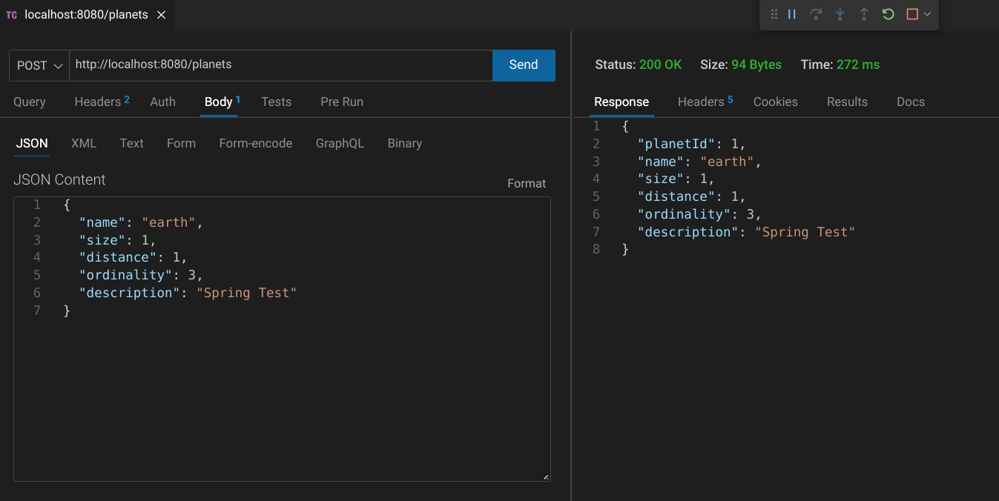

# LCOGT Spring Backend

This is spring boot conversion of [my express solution](https://github.com/jdegand/LCOGT-takehomeinterview) to a past interview test from [LCOGT](https://github.com/LCOGT).

I have created an [angular frontend](https://github.com/jdegand/LCOGT-angular-frontend) that works with this backend.  

## Screenshots

***

***

***

***

***

## Built With

- Maven
- Java 17
- Spring Boot 3.1
- JPA
- H2 Console

## Thoughts

- The interview challenge repo was long outdated before I started.  I used the repo to practice my skills as there are few Java take home tests on Github.  
- Package names are not allowed to use dashes -> 'The original package name 'com.example.LCOGT-spring-backend' is invalid and this project uses 'com.example.LCOGTspringbackend' instead.' It is probably best to not use capitals either. 
- H2 console does not automatically create a table (based on your schema) for you anymore - add `spring.jpa.hibernate.ddl-auto=create-drop` in application.properties
- [JPA query methods](https://docs.spring.io/spring-data/jpa/docs/current/reference/html/#jpa.query-methods) save you a lot of time - many use cases are covered
- However, JPA query methods don't throw errors - they return nothing and have a 200 status code.
- @Digits annotation seems better than @Pattern with a regex
- Easy to swap databases in Spring Boot.  Not much has to be changed - add a driver dependency and update the `application.properties` file.
- Constructor injection is better than field injection(@Autowired) for unit testing. 
- Added DBDataInitializer to add "Mars" to the database on start-up.  I used a SQL migration to add "Mars" to the database in my Express application.  

## Continued Development

- Lombok / Tests added on 'lombok' branch 
- Database Integration / Removal of H2 Console
- Query method exception

## Useful Resources

- [Stack Overflow](https://stackoverflow.com/questions/4078559/how-to-specify-doubles-precision-on-hibernate) - double's precision
- [H2 Docs](https://www.h2database.com/html/tutorial.html#connecting_using_jdbc) - connecting using jdbc
- [Stack Overflow](https://stackoverflow.com/questions/71984489/h2-console-not-being-found-in-browser-while-running-springboot-application) - h2 console not being found 
- [Stack Overflow](https://stackoverflow.com/questions/47221582/h2-in-memory-database-console-not-opening) - h2 console not opening
- [Baeldung](https://www.baeldung.com/spring-boot-h2-database) - spring boot h2 database
- [Stack Overflow](https://stackoverflow.com/questions/47018159/spring-boot-h2-console-not-showing-my-table) - spring h2 console not showing my table
- [YouTube](https://www.youtube.com/watch?v=xgG1JgaG1p4) - How To Access The H2 Database Console In Spring Boot Projects
- [Stack Overflow](https://stackoverflow.com/questions/73983769/h2-database-doesnt-create-table-from-schema-sql) - h2 database doesn't create table from schema
- [Spring Docs](https://docs.spring.io/spring-data/jpa/docs/current/reference/html/#jpa.query-methods) - jpa query methods
- [Stack Overflow](https://stackoverflow.com/questions/17092601/how-to-validate-unique-username-in-spring) - validate unique username in spring
- [Stack Overflow](https://stackoverflow.com/questions/3495368/unique-constraint-with-jpa-and-bean-validation/3499111#3499111) - unique constraint
- [Stack Overflow](https://stackoverflow.com/questions/30321564/swing-jtextfield-max-3-digits-before-decimal-and-max-2-digits-after-decimal) - swing jtextfield max 3 digits before decimal and max 2 digits after decimal
- [Stack Overflow](https://stackoverflow.com/questions/22218350/invalid-escape-sequence-valid-ones-are-b-t-n-f-r-in-java) - invalid escape sequence valid one are b-t-n-f-r in java
- [Stack Overflow](https://stackoverflow.com/questions/35460884/validation-with-double-value-in-spring) - validation with double value in spring
- [Blind Text Generator](https://www.blindtextgenerator.com/lorem-ipsum) - used this to test description max length 
- [Stack Overflow](https://stackoverflow.com/questions/35460884/validation-with-double-value-in-spring) - validation with double value in spring
- [JTuts](http://jtuts.com/2016/05/24/validating-double-values-spring/) - validating double values spring
- [Stack Overflow](https://stackoverflow.com/questions/47088949/validating-size-for-bigdecimal-for-given-length-not-precision) - validating size for big decimal for given length not precision
- [Cheat Sheet Series](https://cheatsheetseries.owasp.org/cheatsheets/Bean_Validation_Cheat_Sheet.html) - Bean Validation Cheat Sheet
- [Stack Overflow](https://stackoverflow.com/questions/39849574/how-to-throw-exceptions-on-search-methods-in-spring-data-jpa) - throw exceptions on search methods in spring data jpa
- [Java Guides](https://www.javaguides.net/2022/11/optional-orelsethrow-method.html) - optional orElseThrow method
- [Spring Docs](https://docs.spring.io/spring-boot/docs/1.3.0.M2/reference/html/boot-features-sql.html) - boot features sql
- [Github](https://github.com/springframeworkguru/spring-boot-mariadb-example/blob/master/src/main/resources/application.properties) - mariadb
- [Reflectoring](https://reflectoring.io/unit-testing-spring-boot/) - unit testing spring boot
- [Blog](https://www.arhohuttunen.com/spring-boot-unit-testing/) - spring boot unit testing
- [Baeldung](https://www.baeldung.com/javax-bigdecimal-validation) - big decimal validation
